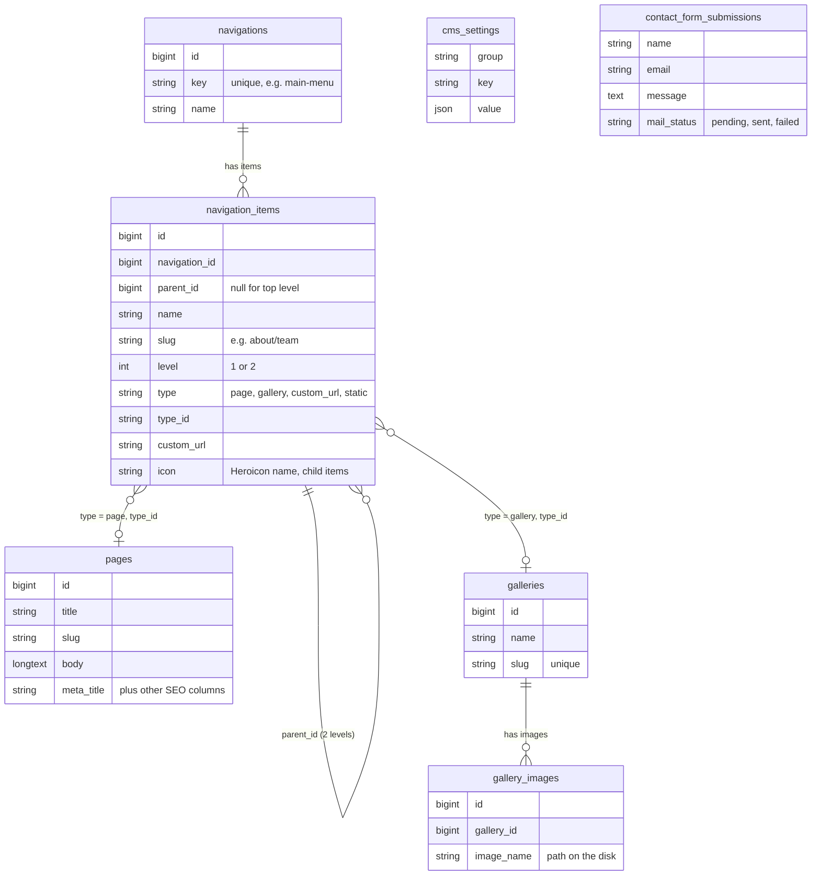

# Concepts

Everything is edited in the Filament panel and read on the frontend through the
`FilamentCms` facade (`zaheensayyed\FilamentCms\Facades\FilamentCms`, aliased as `FilamentCms`).

| Concept | Panel | Frontend API |
| --- | --- | --- |
| **Pages** | Pages | `FilamentCms::getPage($slug)`, catch-all route |
| **Navigations & items** | Navigations → Items | `FilamentCms::getMenu($key)` |
| **Galleries & images** | Galleries → Images | `FilamentCms::getGallery($slug)` |
| **Settings** | Settings (tabs) | `FilamentCms::setting($key, $default)` |
| **Contact submissions** | Contact Submissions | `<x-filament-cms::contact-form />` |
| **Users & roles** | Users, Roles | panel only, see [roles](roles.md) |

## Pages

A title, a unique-ish `slug`, a rich-text `body` and optional SEO fields (meta title and
description, canonical URL, robots, Open Graph, JSON-LD). See [SEO](seo.md).

## Navigations and items

A **navigation** is one menu (header, footer, …). Look it up by its stable **key**
(`main-menu`); the key is set in the panel and doesn't change when the menu is renamed.

A navigation has **items**, up to **2 levels**: top-level items and their `childItems`.
Each item has a `type` that decides what it links to:

| Type | Links to | `$item->url` |
| --- | --- | --- |
| `page` | a Page (`type_id`) | CMS URL of the item's slug, e.g. `/about` |
| `gallery` | a Gallery (`type_id`) | CMS URL of the item's slug |
| `custom_url` | any URL in `custom_url` | that URL (relative paths are made absolute) |
| `static` | a route your app defines | `url($slug)` |

Child slugs include the parent: a "Team" item under "About" has the slug `about/team`.
Child items can also have an **icon**: any [Heroicon](https://heroicons.com) in any style,
picked from a searchable dropdown in the panel and stored as its Blade name
(`heroicon-o-users`). See [rendering icons](menus.md#child-item-icons).

## Galleries and images

A gallery has a name, slug, description and many images. Images are uploaded in the panel
to Filament's default disk; `$image->image_url` gives the public URL.

## Settings

Grouped key/value settings edited on the Settings page (one tab per group): Company Info,
SEO Defaults and Contact Form. Read any of them with `FilamentCms::setting('group.key')`.
See the [key reference](settings.md).

## Schema

